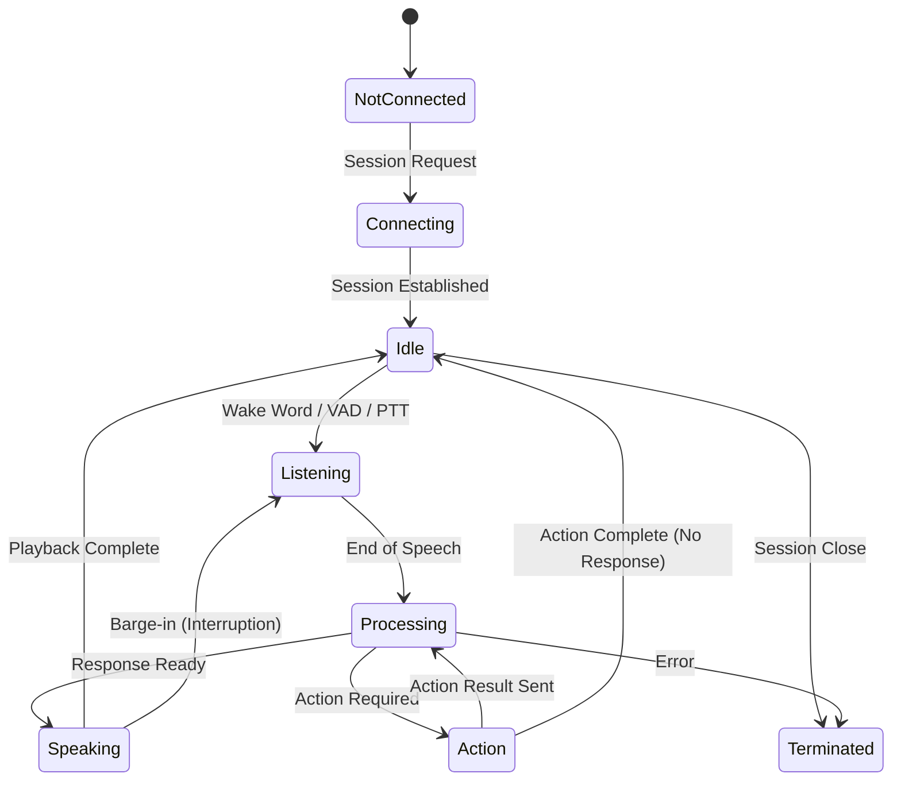

# 5. Core Interaction Model

This section defines the normative behavior of the Voice Interaction Protocol (VIP). It establishes the rules for turn-taking, the finite state machine (FSM) governing the session, and the mechanisms for context synchronization and action execution.

## 5.1 Interaction Turns

VIP models voice interaction as a sequence of discrete "Turns." While the underlying transport (e.g., WebRTC) may be full-duplex, the logical flow of information follows a conversational turn-taking structure.

### 5.1.1 Turn Definition
*   **User Turn:** The period during which the User Agent is capturing audio input. A User Turn is initiated by a specific trigger (Wake Word or Push-to-Talk) or by the detection of speech activity (VAD).
*   **System Turn:** The period during which the Voice Runtime is processing input, executing logic, or streaming audio output.

### 5.1.2 Turn-Taking Rules
1.  **Exclusivity:** Logically, only one entity (User or System) holds the "floor" for the purpose of intent resolution at any given moment.
2.  **Handover:**
    *   **User -> System:** Triggered implicitly by `VAD_End_of_Speech` or explicitly by a `Stop_Capture` signal.
    *   **System -> User:** Triggered upon completion of TTS playback or upon a request for user input (e.g., a clarification prompt).
3.  **Barge-in (Interruption):** The User Agent **MUST** support "Barge-in." If valid speech input is detected during a System Turn (specifically the `Speaking` state):
    *   Audio playback **MUST** halt immediately.
    *   The system state **MUST** transition immediately to `Listening`.
    *   The interrupted System Turn is discarded or marked as incomplete in the conversation history.

## 5.2 State Machine

The User Agent and Voice Runtime must maintain a synchronized state machine. The following states and transitions are normative.

### 5.2.1 State Definitions

| State | Role | Description |
| :--- | :--- | :--- |
| **Not Connected** | Initial | No active session exists. |
| **Connecting** | Transitional | Handshake and authentication in progress. |
| **Idle** | Passive | Session is active. Microphone is open for Wake Word (if enabled) but not streaming. System is waiting for triggers. |
| **Listening** | Active Input | User audio is being captured and streamed to the Provider/Runtime. Visual indicators should reflect "Listening." |
| **Processing** | Computation | Audio input has ceased. The Runtime is performing ASR and LLM Inference. |
| **Speaking** | Active Output | The User Agent is receiving and rendering an audio stream. |
| **Action** | Execution | The Runtime has commanded the User Agent to perform a client-side task (e.g., navigation). |

### 5.2.2 Transition Events
*   `VAD_Start`: Transitions `Idle` -> `Listening`.
*   `VAD_End`: Transitions `Listening` -> `Processing`.
*   `Intent_Resolved`: Transitions `Processing` -> `Action` (if a tool call is required) or `Speaking` (if a verbal reply is generated).
*   `Action_Complete`: Transitions `Action` -> `Processing` (to generate confirmation speech) or `Idle`.
*   `Playback_Complete`: Transitions `Speaking` -> `Idle` or `Listening` (if a follow-up question was asked).

## 5.3 Action Invocation and Context Propagation

VIP requires the User Agent to explicitly declare its capabilities and state. The Voice Runtime cannot "guess" the application state; it must be informed via the **Context Propagation** mechanism.

### 5.3.1 Action Registry
The Action Registry is a JSON schema definition transmitted by the User Agent. It acts as the "Tool Definition" for the LLM.
*   The User Agent **MUST** provide an `actions` map containing unique identifiers, descriptions, and parameter schemas for every interactive element (buttons, inputs, navigation routes).
*   The Voice Runtime **MUST NOT** hallucinate actions. It is restricted to invoking only those actions currently present in the Registry.

### 5.3.2 Narrated State Description
To ensure the AI understands the visual context, the User Agent **MUST** synthesize a textual description of the current view (the "Narrated State") and transmit it:
1.  Upon Session Initialization.
2.  Whenever the route or significant UI state changes (e.g., a modal opens).

### 5.3.3 Invocation Flow
1.  **Intent Detection:** The Runtime determines the user wants to perform a specific action (e.g., "Go to settings").
2.  **Resolution:** The Runtime matches the intent to an entry in the **Action Registry**.
3.  **Command:** The Runtime sends an `invoke_action` message containing the `action_id` and required `parameters`.
4.  **Execution:** The User Agent executes the corresponding client-side code.
5.  **Feedback:** The User Agent returns a status payload (`success` or `error`) to the Runtime.

## 5.4 Interaction Lifecycle

A standard VIP interaction loop proceeds as follows:

1.  **Session Establishment:**
    *   Client authenticates via VIP Server.
    *   Client connects to Model Provider (Internal Mode).
    *   Client transmits initial **Narrated State** and **Action Registry**.
2.  **Input Loop:**
    *   State becomes `Idle`.
    *   User triggering event (VAD/Button) transitions state to `Listening`.
    *   Audio is streamed to Provider.
3.  **Resolution Loop:**
    *   Silence detected; State transitions to `Processing`.
    *   Model Provider transcribes audio and evaluates against the Registry.
4.  **Output/Action Loop:**
    *   **Case A (Verbal Reply):** State transitions to `Speaking`. Audio is streamed to Client.
    *   **Case B (Action):** State transitions to `Action`. Client executes command.
5.  **Termination:**
    *   Session ends via user command ("Hang up") or application logic.

## 5.5 Event Handling Rules

Compliant implementations must adhere to the following event handling strictures:

### 5.5.1 Mandatory Events
The following events are normative and must be emitted by the respective parties:
*   `session.connected`: Emitted by Server upon successful handshake.
*   `input.detected`: Emitted by Client upon VAD activation.
*   `action.invoke`: Emitted by Runtime when a tool call is generated.
*   `action.result`: Emitted by Client after attempting execution.
*   `error.fatal`: Emitted by any party upon unrecoverable failure.

### 5.5.2 Execution Constraints
*   **Deterministic Fallback:** If an `invoke_action` request fails (e.g., button no longer exists), the User Agent **MUST** return a standardized error payload. The Runtime **SHOULD** then inform the user verbally of the failure.
*   **Safety:** The User Agent **MUST** validate all `invoke_action` parameters against the schema defined in the Action Registry before execution to prevent injection attacks or malformed state changes.

## 5.6 Roles and Metadata

All messages within the protocol are attributed to specific roles to maintain conversation history context.

| Role | Identifier | Description |
| :--- | :--- | :--- |
| **User** | `user` | The human operator. Metadata includes `user_id` (if authenticated) and `locale`. |
| **AI** | `assistant` | The Voice Runtime. Metadata includes `model_id` and `latency_metrics`. |
| **System** | `system` | Protocol-level messages (errors, state updates) not directly attributed to the conversational personality. |