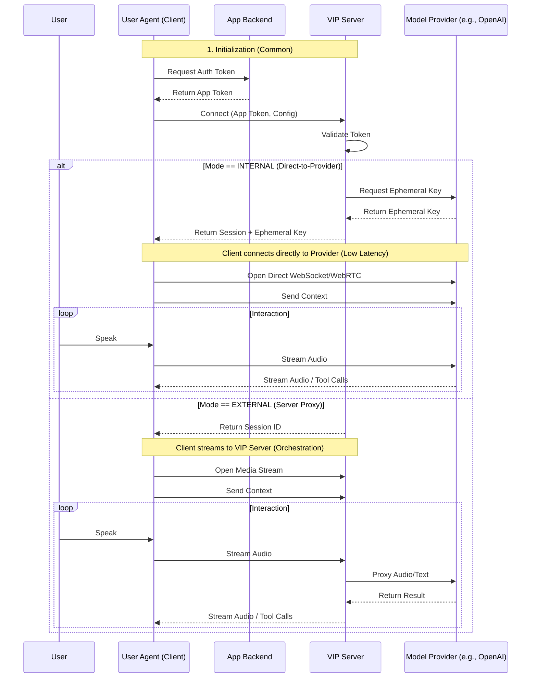

# 7. State and Flow Management

This section defines the normative Finite State Machine (FSM) for the Voice Interaction Protocol. To ensure interoperability between the User Agent (Client) and the Voice Runtime (Server/Provider), all implementations **MUST** adhere to the discrete states and transition rules defined below.

## 7.1 State Model Overview

VIP relies on a synchronous, turn-based state model to manage the complexities of bi-directional audio and action execution. The state machine serves two primary purposes:
1.  **Floor Management:** It strictly defines which entity (User or System) allows to transmit information at any given millisecond.
2.  **Context Integrity:** It ensures that actions and context updates occur only during valid windows, preventing race conditions between user inputs and system outputs.

The interaction state is global to the **Session**; both the Client and Server **MUST** maintain a synchronized view of this state.

## 7.2 Core Interaction States

The following states are mutually exclusive. At any given moment, a VIP session **MUST** be in exactly one of these states.

### 7.2.1 Not Connected (`not_connected`)
**Description:** The initial state where no active session exists between the Client and the VIP Server.
*   **Entry Condition:** Application startup or after `session.terminated`.
*   **Allowed Operations:** `session.initialize`, `config.load`.
*   **Forbidden Operations:** Audio streaming, Action invocation.

### 7.2.2 Connecting (`connecting`)
**Description:** The transitional state during the Session Handshake. The Client is validating tokens with the VIP Server and establishing WebSocket/WebRTC paths.
*   **Entry Condition:** Client initiates connection request.
*   **Exit Condition:** Successful authentication (`Idle`) or failure (`Not Connected`).
*   **Allowed Operations:** Token exchange, Protocol negotiation.

### 7.2.3 Idle (`idle`)
**Description:** The standby state. The session is active, context is synchronized, and the system is waiting for a trigger.
*   **Entry Condition:** Session established, or completion of a previous interaction turn.
*   **Allowed Operations:** `state.update` (Context Propagation), `input.start` (Wake word/PTT).
*   **Forbidden Operations:** System audio output (except unsolicited notifications), ASR processing.

### 7.2.4 Listening (`user_speaking`)
**Description:** The User Agent is actively capturing audio and streaming it to the Provider.
*   **Entry Condition:** Wake word detected, Push-to-Talk (PTT) asserted, or VAD triggering.
*   **Exit Condition:** `input.end` (Silence detected) or `input.timeout`.
*   **Allowed Operations:** Audio streaming, Stop capture.
*   **Forbidden Operations:** System audio output, Context updates.

### 7.2.5 Processing (`ai_thinking`)
**Description:** Input capture has ceased. The Provider is performing Speech-to-Text (STT) and LLM inference.
*   **Entry Condition:** End of user speech.
*   **Exit Condition:** Response ready (`Speaking`) or Tool Call generated (`Action`).
*   **Allowed Operations:** Interruption (User barge-in).
*   **Forbidden Operations:** Context updates.

### 7.2.6 Speaking (`ai_speaking`)
**Description:** The System is streaming synthesized audio (TTS) to the User Agent.
*   **Entry Condition:** LLM response generation started.
*   **Exit Condition:** Playback complete (`Idle`) or Interruption (`Listening`).
*   **Allowed Operations:** Interruption (User barge-in).
*   **Forbidden Operations:** Action invocation (unless parallel to speech).

### 7.2.7 Action (`invoke_action`)
**Description:** The System has requested the Client to execute a deterministic command (e.g., navigation, form fill). The System waits for a result code.
*   **Entry Condition:** `action.invoke` message received.
*   **Exit Condition:** `action.result` sent by Client.
*   **Allowed Operations:** UI updates, Client logic execution.
*   **Forbidden Operations:** Audio streaming.

## 7.3 State Transition Rules

Implementations **MUST** enforce the following transition matrix. Any transition not explicitly listed below is **INVALID** and **MUST** result in a protocol error.

| From State | To State | Trigger Event | Description |
| :--- | :--- | :--- | :--- |
| **Not Connected** | **Connecting** | `client.connect` | Client initiates handshake. |
| **Connecting** | **Idle** | `server.ready` | Auth successful, session active. |
| **Idle** | **Listening** | `input.start` | Wake word, VAD, or PTT. |
| **Idle** | **Speaking** | `server.announce` | Unsolicited system message (e.g., Intro). |
| **Listening** | **Processing** | `input.end` | Silence detected or PTT released. |
| **Listening** | **Idle** | `input.cancel` | User cancelled capture. |
| **Processing** | **Speaking** | `response.audio` | LLM generates verbal reply. |
| **Processing** | **Action** | `response.tool` | LLM requests UI action. |
| **Processing** | **Listening** | `input.barge_in` | User interrupts thinking. |
| **Speaking** | **Idle** | `audio.complete` | TTS playback finished. |
| **Speaking** | **Listening** | `input.barge_in` | User interrupts playback. |
| **Action** | **Processing** | `action.result` | Result sent back to AI for confirmation. |
| **Action** | **Idle** | `action.done` | Action complete, no follow-up needed. |
| **Any State** | **Not Connected** | `session.close` | Hang up or network failure. |

## 7.4 Interaction Flow Lifecycle

The compliant lifecycle of a VIP interaction flow is defined as follows:

1.  **Initialization:**
    *   Client obtains auth token from Application Backend.
    *   Client connects to VIP Server (State: `Connecting`).
    *   VIP Server validates token, issues Ephemeral Key (Internal Mode).
    *   Client transmits initial `Narrated State Description` and `Action Registry`.
    *   State transitions to `Idle`.

2.  **Introduction (Optional):**
    *   If configured to `activate_on: first_visit`, Server sends introductory audio.
    *   State: `Idle` -> `Speaking` -> `Idle`.

3.  **The Interaction Loop:**
    *   **Input:** User Trigger -> `Listening` (Audio Stream).
    *   **Handoff:** Silence -> `Processing`.
    *   **Resolution:**
        *   *Scenario A (Reply):* `Processing` -> `Speaking` -> `Idle`.
        *   *Scenario B (Command):* `Processing` -> `Action` (Client executes) -> `Processing` (AI acknowledges) -> `Speaking` -> `Idle`.

4.  **Termination:**
    *   User explicitly says "Stop" or calls `Hang Call`.
    *   State transitions to `Not Connected`.

## 7.5 Interruption Handling Rules

To support natural conversation, VIP enforces "Barge-in" logic.

1.  **Permissible States:** Interruption is **ALLOWED** only during `Processing` and `Speaking` states.
2.  **Trigger Mechanism:**
    *   **Manual:** User presses "Tap to Speak" or holds spacebar.
    *   **VAD:** Voice Activity Detection identifies high-confidence speech input above the noise floor.
3.  **Transition Logic:**
    *   Upon trigger, the Client **MUST** immediately stop audio playback.
    *   The Client **MUST** emit an `input.barge_in` event.
    *   The State **MUST** transition immediately to `Listening`.
4.  **Buffer Handling:** Any remaining audio buffer in the `Speaking` queue or pending inference in the `Processing` queue **MUST** be discarded. The System **MUST NOT** attempt to finish the previous sentence after the user starts speaking.

## 7.6 Error and Recovery Flow

Errors define specific state fallback behaviors:

*   **Recognition Error (No Speech/No Match):**
    *   Occurs in: `Processing`.
    *   Behavior: System **SHOULD** play a brief error earcon (sound) or prompt.
    *   Transition: `Processing` -> `Idle`.
*   **Action Failure (e.g., Element not found):**
    *   Occurs in: `Action`.
    *   Behavior: Client sends `action.result` with status `error`.
    *   Transition: `Action` -> `Processing`. The AI **SHOULD** verbally inform the user of the failure.
*   **Network/Fatal Error:**
    *   Occurs in: Any State.
    *   Transition: -> `Not Connected`.

## 7.7 Compliance Requirements

To be VIP compliant:
1.  **Mandatory States:** Implementation of `Idle`, `Listening`, `Processing`, and `Speaking` is mandatory.
2.  **Visual Indication:** The Client **MUST** provide visual feedback (e.g., icons, animations, volume waves) distinct to each state to inform the user of the system status.
3.  **Deterministic Transitions:** The implementation **MUST NOT** allow state transitions driven by side effects (e.g., a timer transition from `Idle` to `Listening` without user input or configuration).
